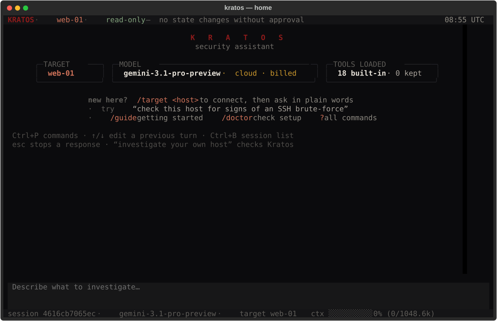
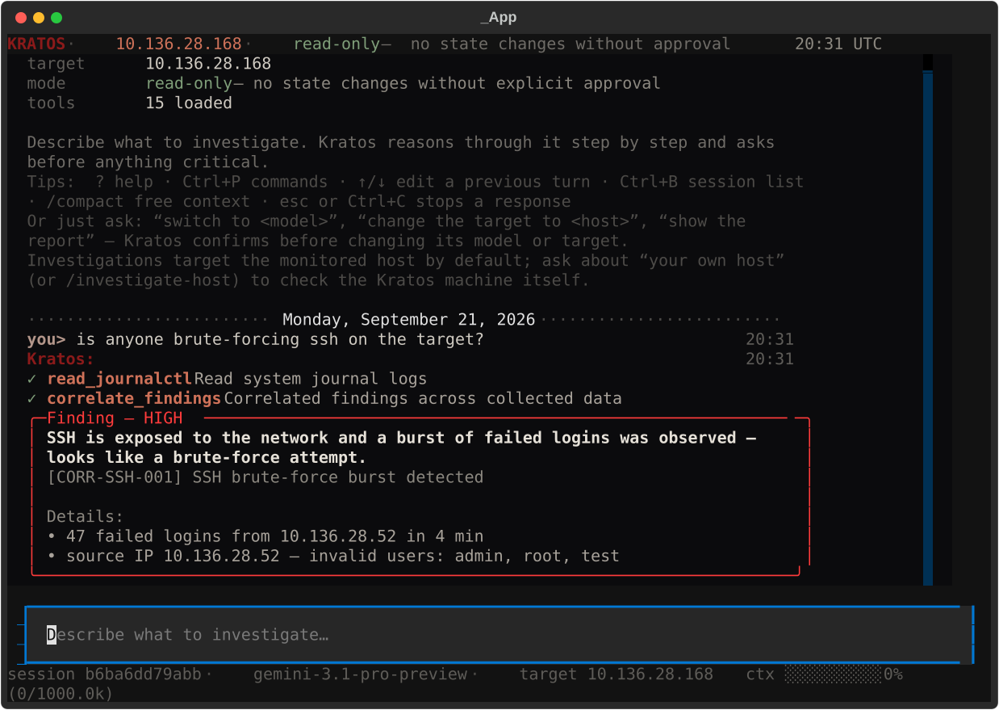
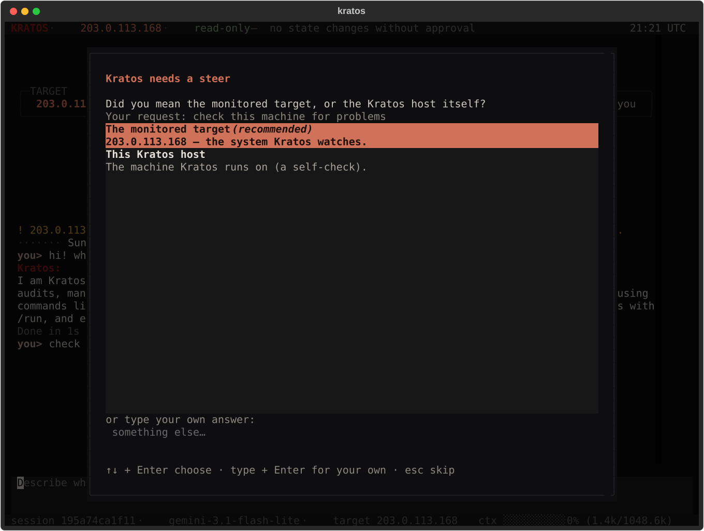
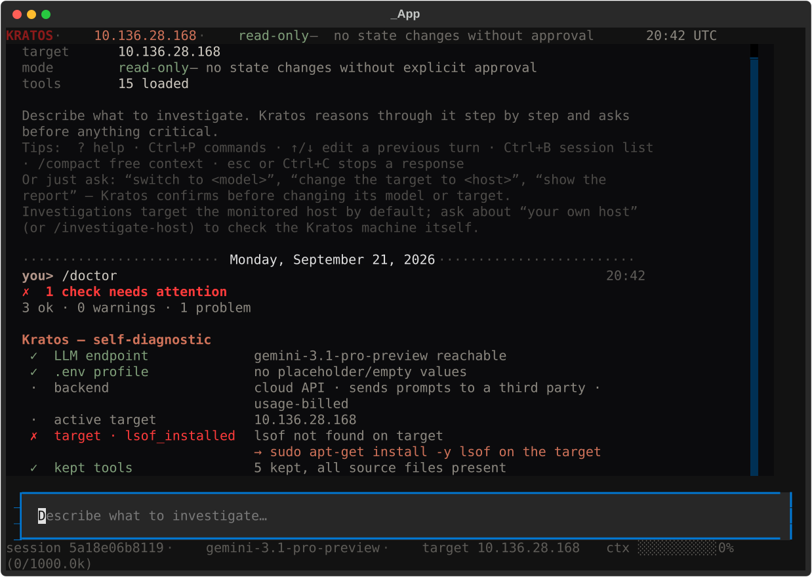
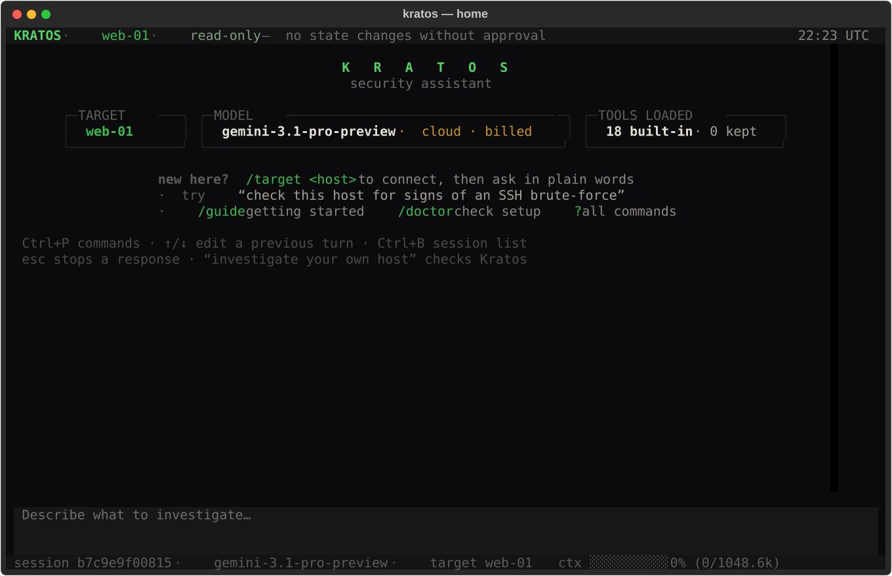
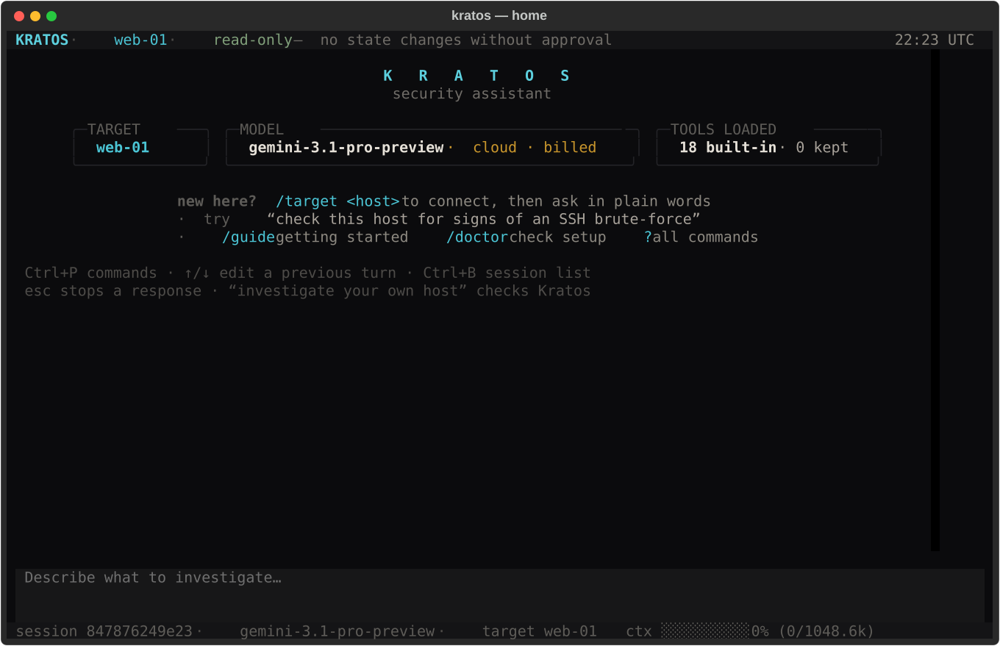
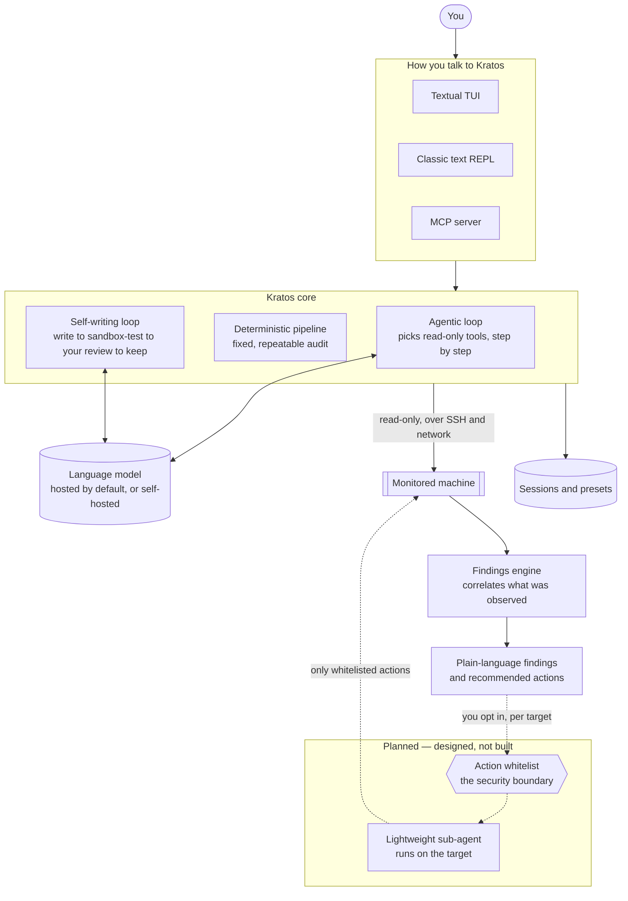

# Kratos

**Self-hostable, self-growing security analysis, with a terminal UI built for all.**

<p align="center">
  
</p>

Kratos looks over a machine and tells you, in plain English, what's going on with it: failed logins, exposed ports, changed files, and so on. It explains what it found and what it would do about it. By default it doesn't change the target itself — acting on its advice is your call (see [Safe by default](#safe-by-default)).

By default it talks to a hosted model, so you can start in a few minutes without running your own. If you'd rather keep everything on your own hardware, point it at a model you host yourself and no data leaves the box.

When Kratos runs into something it has no tool for, it can write one, test it in a sandbox, and keep it — but only after you've read the code and approved it.

Kratos started as a Bachelor's thesis at Tampere University of Applied Sciences (Software Engineering, 2026), asking whether a small model running on cheap edge hardware could do real, explainable security analysis without sending anything to the cloud. It has since grown into a full assistant you talk to in plain language.

---

## What it looks like in use

You describe a goal. Kratos decides which read-only checks to run, does them, correlates what it saw, and writes up findings with a recommended next step.

<p align="center">
  
</p>

When a request could go several genuinely different ways, it asks first instead of guessing — with the options laid out and one recommended:

<p align="center">
  
</p>

And it can check its own setup — model, target, tools — and tell you the fix when something's off:

<p align="center">
  
</p>

---

## Safe by default

Kratos observes and recommends. In every current build it does not, and cannot, change the machine it's watching. Every tool it can point at a target is read-only — it inspects logs, ports, processes, and files, but there is no path for it to alter anything there. It reads, it reasons, it reports. What to do with that is up to a person.

That's the default, not a permanent limit. A narrow, opt-in path for Kratos to *act* on a target — dispatching only a small set of pre-approved, whitelisted actions to a lightweight agent running there — is designed and on the roadmap. It stays off for every target unless you turn it on, and the whitelist of allowed actions (not a password prompt, not a signature) is what keeps it safe. **This part is not built yet.** Until it is, Kratos only observes a target — that's the whole of what it can do to one today.

Everywhere a decision has real consequences — running a local command, keeping a self-written tool — Kratos asks, and a non-answer means no. There is no "force yes."

---

## Your data and your bill

Be aware of two things before you point Kratos at anything real:

- **By default, your data goes to a hosted model.** The logs, scan output, and findings Kratos reasons over are sent to whatever LLM you configure. If that's a cloud provider, that provider sees them. If you want nothing to leave your hardware, self-host the model (see [Backends](#backends)) — Kratos works the same either way.
- **A cloud model costs money per run.** Each investigation spends tokens. `/usage` shows what a session has cost so far, and scheduled runs warn you before they rack up a recurring bill. A self-hosted model is free to run.

Alerts (from schedules, triggers, or the notify tool) go through [ntfy](https://ntfy.sh) and are **off until you choose your own topic** (`KRATOS_NTFY_TOPIC` in `.env`; `/doctor` suggests a random one). Kratos ships no default topic on purpose: an ntfy topic has no password, so **anyone who knows the topic name can read every alert sent to it**, findings included. On the public ntfy.sh server, use a long random topic at the very least; for real deployments, run your own ntfy server (`KRATOS_NTFY_BASE_URL`) or use an ntfy access token (`KRATOS_NTFY_TOKEN`).

One optional feature, threat-intel enrichment, is **off by default** and, when you turn it on, sends an IP address to a reputation service to check it. It's clearly separate from the core analysis, and Kratos runs fully without it.

---

## Install

You'll need Python 3.10 or newer and SSH access to whatever machine you want Kratos to watch.

```bash
git clone https://github.com/TahrimWalid/kratos.git
cd kratos
python -m venv .venv && source .venv/bin/activate
pip install -e .
```

Kratos also uses a couple of standard command-line tools for its network checks, which aren't Python packages — install them on the **Kratos machine** with your package manager:

- **`nmap`** (required for the port scan and the standard audit) — e.g. `sudo apt install nmap`.
- **`nuclei`** (optional, for deeper vulnerability scanning) — see the [nuclei install guide](https://github.com/projectdiscovery/nuclei#install-nuclei). Kratos works without it; the vulnerability scan simply skips the active checks.

Two more small tools — `yara` and `lsof` — go on the **machine you watch**, not the Kratos host; Kratos's setup check tells you if they're missing and gives you the command.

Then tell Kratos which model to use. Copy the example config and fill in three values:

```bash
cp .env.example .env
# edit .env:
#   LLM_BASE_URL   the model's OpenAI-compatible endpoint
#   LLM_API_KEY    your key (or a placeholder for a local server)
#   LLM_MODEL      the model name
```

Start it:

```bash
kratos
```

---

## First steps

Kratos opens on the home screen above. From there:

1. **Connect a machine.** `/target <host>` points Kratos at a host over SSH and checks what it needs (a key, a couple of read permissions, one or two small tools). It walks you through anything missing.
2. **Ask a question.** Type what you want to know, in normal words — *"has anyone been trying to log in as root?"*, *"is anything listening that shouldn't be?"* Kratos picks its own read-only tools and explains what it finds.
3. **Check your setup** any time with `/doctor`, and see a session's findings with `/report`.

Type `/guide` inside Kratos for the short version, `?` for every command, or read the full [user guide](docs/GUIDE.md).

Two ways to run an analysis:

- **Just ask** and let Kratos reason step by step, choosing tools based on what it finds.
- **`/run`** for a fixed, repeatable audit — the same checks every time, with no model in the loop.

---

## It grows with you

If Kratos needs a check it doesn't have, `/evolve` builds one. You give it the idea; it writes the tool and a test, runs the test in a locked-down sandbox with no network or filesystem access, and shows you the result. Nothing is kept until you read the code and say yes. Kept tools become part of Kratos for next time — and you can always ask it to run just one tool, directly, with `/use`.

You can also save any investigation as a **preset** to re-run or schedule, and chain read-only tools into a **pipeline** for a repeatable, deterministic sweep.

---

## Themes

Kratos ships in Kratos Red by default, with Slate Blue, Matrix Green, and Cyan built in (`Ctrl+T`, or Settings). Danger-red and safe-green stay constant in every theme, so the colors that mean something never move.

<p align="center">
  
  
</p>

---

## Backends

One setting drives every backend. Point `LLM_BASE_URL` / `LLM_API_KEY` / `LLM_MODEL` at:

- a **hosted provider** (any OpenAI-compatible API) — the quickest way to start;
- a **model you host yourself** — Ollama, vLLM, or llama.cpp — if you want your data to stay entirely local.

Self-hosting is fully supported; it's just not the default anymore, because most people would rather not run a model to try a tool. The trade-off is yours to make, per your own privacy needs.

---

## How it's built



The core reasons about a goal and picks its own read-only tools; a findings engine (plain rules, no model) correlates what was observed into findings. The dashed part — a small agent on the target that can carry out a fixed set of whitelisted actions — is designed but not built. More detail in [docs/DESIGN.md](docs/DESIGN.md).

---

## Status and roadmap

Kratos is under active development. Working today: the agentic and deterministic analysis, read-only investigation over SSH, the findings engine, the self-writing loop, presets and pipelines, scheduling, the MCP server, and the terminal UI.

On the roadmap, not yet built: the opt-in, whitelist-gated execution path (letting Kratos act on a target through a lightweight sub-agent), and running against several machines at once. Both are gated on the action whitelist being designed and independently reviewed first — that's the safety boundary, and it comes before any of it ships.

---

## Where it came from

Kratos began as a Bachelor's thesis (Tampere University of Applied Sciences, Software Engineering, 2026): could a quantized model on ARM edge hardware produce meaningful, explainable security analysis with nothing sent off the machine? The answer was yes. It has grown well past that first prototype since, but the two ideas at its center — explain everything in plain language, and never act without a person — are the same ones it started with.

## License

Kratos is released under the [MIT License](LICENSE) — use it, change it, build on
it freely; just keep the copyright notice when you redistribute it.

One exception for the bundled extras: the YARA rules under `yara_rules/` are
third-party and stay under their own GPLv2 license (see
[`yara_rules/README.md`](yara_rules/README.md)). They're included as separate data
files the scanner reads, not part of Kratos's own code.
