# Kratos — the complete guide

This is the long, friendly version. If you've never used a tool like this, start
at the top and go in order. If you just want a reminder of one thing, jump to it:

1. [What Kratos is, in one minute](#what-kratos-is-in-one-minute)
2. [What you need before you start](#what-you-need-before-you-start)
3. [Installing Kratos](#installing-kratos)
4. [Connecting it to a model](#connecting-it-to-a-model)
5. [The first launch](#the-first-launch)
6. [Connecting a machine to watch](#connecting-a-machine-to-watch)
7. [Your first investigation](#your-first-investigation)
8. [Understanding findings](#understanding-findings)
9. [When Kratos asks you a question](#when-kratos-asks-you-a-question)
10. [When Kratos asks permission](#when-kratos-asks-permission)
11. [Two ways to analyze](#two-ways-to-analyze)
12. [The commands](#the-commands)
13. [Questions about time](#questions-about-time)
14. [Machines you reach through a sub-agent](#machines-you-reach-through-a-sub-agent)
15. [Building a new tool with /evolve](#building-a-new-tool-with-evolve)
16. [Saving and repeating work](#saving-and-repeating-work)
17. [Keeping an eye on things](#keeping-an-eye-on-things)
18. [Using Kratos from the command line and other tools](#using-kratos-from-the-command-line-and-other-tools)
19. [The experimental fix channel](#the-experimental-fix-channel)
20. [Making it yours](#making-it-yours)
21. [When something goes wrong](#when-something-goes-wrong)
22. [Words you'll see](#words-youll-see)

---

## What Kratos is, in one minute

Kratos is a program you talk to. You point it at a computer — a server, a home
lab box, your own laptop — and ask it questions about that computer's security in
plain words. It goes and looks (at the logs, the open network ports, the running
programs, files that changed), works out what's going on, and tells you in a way
you can actually read. If it finds a problem, it tells you how to fix it.

The one thing to hold onto: **by default, Kratos observes and recommends — it
doesn't change the machine itself.** It reads and it advises; whether you act on
the advice is up to you. (There is one experimental, off-by-default exception — see
[The experimental fix channel](#the-experimental-fix-channel) — which you'll never
hit by accident.)

You don't need to know the names of any security tools. You describe what you
care about ("has anyone been trying to break in?") and Kratos figures out which
checks to run.

---

## What you need before you start

Three things:

- **A computer to run Kratos on.** Any recent Linux machine works. You'll use a
  terminal (the black text window). Kratos itself is light.
- **A machine you want to watch, and a way to reach it.** This can be the same
  computer Kratos runs on, another server, or a box on your network. Usually that's
  SSH with a key (the standard passwordless way to log into a server — Kratos can
  create the key for you). For a box you can't reach over SSH, a small agent you
  install on it can connect to Kratos instead.
- **A model for Kratos to think with.** By default this is a hosted AI model you
  reach with an API key (quick to set up). If you'd rather nothing leaves your own
  hardware, you can run a model yourself instead. Both are covered below.

---

## Installing Kratos

You need Python 3.10 or newer. In a terminal:

```bash
git clone https://github.com/TahrimWalid/kratos.git
cd kratos
python3 -m venv .venv
source .venv/bin/activate
pip install -e .
```

(On Debian or Ubuntu, if `python3 -m venv` complains, install the `python3-venv`
package first.)

That last line installs Kratos into a private environment so it doesn't disturb
anything else on your system.

Kratos also leans on one standard command-line tool for its network checks that
isn't a Python package: **`nmap`**. Install it on the Kratos machine with your
package manager (for example `sudo apt install nmap`). If you want the deeper
vulnerability scan as well, also install **`nuclei`** (optional — Kratos runs fine
without it and just skips those active checks). Two more tiny tools, `yara` and
`lsof`, go on the machine you *watch*, not here — and Kratos's setup check will tell
you if they're missing and hand you the command.

The vulnerability scan can also match the versions of a machine's network services
against a list of known CVEs. That list isn't bundled; to add it, run:

```bash
kratos vulscan-install
```

It downloads nmap's vulscan script and builds an up-to-date CVE list from the
public feeds of the US National Vulnerability Database (NVD). That takes about a
minute; run the same command again every month or so to refresh it. `/doctor` shows
how current your copy is. If the list is missing or old, Kratos says in its answer
which CVEs weren't checked rather than calling a service up to date. (This product
uses data from the NVD API but is not endorsed or certified by the NVD.)

Keep in mind how the matching works: vulscan compares the product name and version
that nmap detects against the text of each CVE description. That finds real
candidates quickly, but it is a heuristic: some matches won't apply to your exact
build (distributions often patch without changing the version number), and some
real issues won't be matched. Treat CVE results as leads to check, not a verdict.

Only if you want Kratos to build new tools for itself (`/evolve`): install
[Incus](https://linuxcontainers.org/incus/) on the Kratos machine. Every new tool is
tested inside a throwaway container with no network; the first `/evolve` builds that
container image once, which takes a few minutes and needs internet.

When that's done, Kratos is installed — but it still needs a model, which is the
next step.

---

## Connecting it to a model

Kratos needs an AI model to reason with. You tell it which one by editing a small
settings file. Create it with:

```bash
kratos init
```

It prints where the file is. Open that `.env` file in any text editor (only your
user can read it, since it will hold your API key). You're setting three values:

| Setting | What it is |
| --- | --- |
| `LLM_BASE_URL` | the web address of the model's API |
| `LLM_API_KEY` | your key for that model (or a placeholder for a local one) |
| `LLM_MODEL` | the name of the model to use |

**Option A — a hosted model (the quick start).** Sign up with any provider that
offers an OpenAI-compatible API, get an API key, and put its address, your key,
and a model name into those three settings. This is the fastest way to get going.
Be aware: with a hosted model, the things Kratos looks at (log lines, scan
results) are sent to that provider to be analyzed. That's normal for a cloud
service, but it's worth knowing. It also costs a small amount per investigation.

**Option B — a model you run yourself (fully private).** If you install something
like [Ollama](https://ollama.com) and pull a model, you can point Kratos at it on
your own machine. Then nothing leaves your hardware, and there's no per-use cost.
If you leave every profile in `.env` commented out, Kratos uses a local Ollama at
`127.0.0.1:11434`, so if you're running one, you may not need to change anything. This is a bit more setup, but it's the
private, free path.

You can change this later at any time from inside Kratos with `/model` — you don't
have to get it perfect now.

**Where Kratos keeps things.** If you installed from a git checkout as above,
everything stays in that folder: the settings file `.env`, your sessions and
findings in `data/`, tools you've approved in `kept_tools/`, and the CVE list in
`vulscan/`. If Kratos was installed as a package instead (`pip install` without
`-e`), it uses your per-user folders: settings in `~/.config/kratos/.env`, the rest
under `~/.local/share/kratos/`. To keep everything in one folder of your choice, set
the environment variable `KRATOS_HOME` before starting Kratos. Either way, it
doesn't matter which folder you start `kratos` from, and `/doctor` shows the exact
paths.

---

## The first launch

Start Kratos:

```bash
kratos
```

> The first time, Kratos asks whether you trust it to run on this machine, and
> offers to remember a default target. It only asks once. Kratos has no built-in
> target: if you skip that question, the first machine you point it at (with
> `/target` or a new session) becomes the default, which is what command-line and
> scheduled runs use. `KRATOS_SSH_HOST` overrides it for a single command.

Every later launch opens on your past sessions, newest first and grouped by
day. Type to filter them, press Enter to resume one, or `n` for a new session:

<p align="center">
  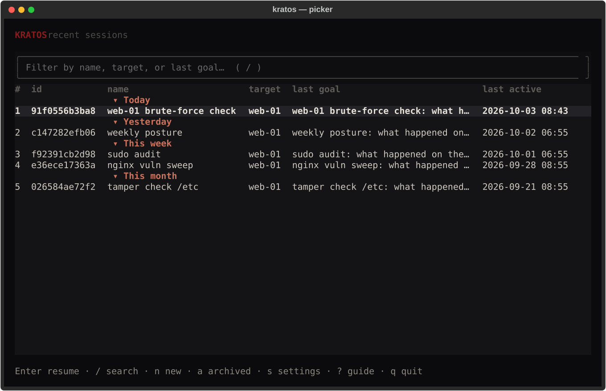
</p>

Once you're in a session, you'll see the home screen:

<p align="center">
  
</p>

The three cards tell you, at a glance, which machine is being watched (**target**),
which **model** Kratos is using and whether it's local (free, private) or cloud
(billed), and how many **tools** it has. The tips at the bottom point at the first
things to do. You can type a question at any time, or a command starting with `/`.

Useful to know from the start:

- Type `?` to see every command.
- Type `/guide` for a short in-app version of this walkthrough — you can also open
  it with `?` right from the session picker, before you're even in a session.
- Press `Ctrl+P` to search commands instead of remembering them.

<p align="center">
  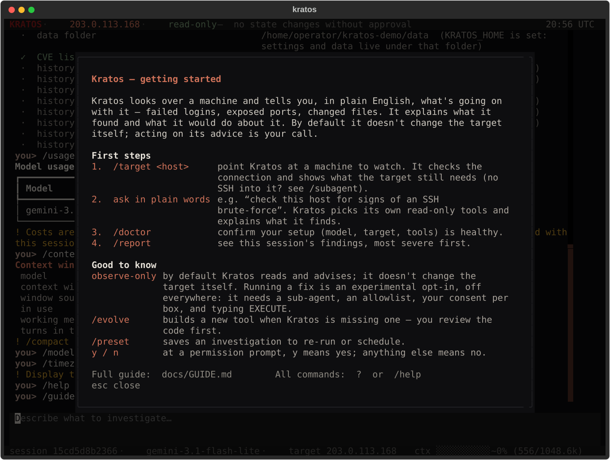
</p>

---

## Connecting a machine to watch

Before Kratos can investigate a machine, it needs to be able to reach it and read
a few things. When you add a new machine, Kratos first asks **how it should reach
the box** — there are two ways, and for most people the first is the right one:

- **Direct SSH (recommended).** Kratos logs into the box over SSH with your key and
  reads its logs, config, processes, and ports — read-only. Nothing is installed on
  the box. This runs every investigation tool, so it's what you want unless you
  have a specific reason not to. You authorize Kratos's SSH key on the box once
  (Kratos gives you the exact command) and make sure it's reachable.
- **Sub-agent (for boxes you can't or won't open to SSH).** You install a small
  agent on the box; it *dials out* to Kratos, so there's no inbound port to open —
  handy for a machine behind NAT or a strict firewall. It streams basic status
  (always-on) and answers investigations with its own fixed set of reads: logs,
  processes, open files, config checks, file hashes and YARA scans. It can't run
  anything else, and Kratos can't send it commands. Two things work differently:
  network scans (open ports, known vulnerabilities) need a direct path from Kratos,
  so they're skipped for a box reached only this way, and the answer says what
  wasn't checked; and YARA uses the rules on the box itself and reports rule, file
  and offset only. Credential files (SSH keys, `.env`, shadow…) are never scanned.
- **Skip for now** — set it up later with `/target` or `/subagent`.

Kratos never guesses which machine a target is. Picking **Sub-agent** links the box
to its agent once it checks in; if you later type an address that looks like a box
you've already paired, Kratos *asks* before linking. `/target link` changes how a
target is reached (sub-agent only, or SSH first with the sub-agent as a fallback),
and `/doctor` shows which way it is reached right now. An agent installed before
this feature needs one update: open `/subagent`, select it and press **g** — it
keeps its pairing.

<p align="center">
  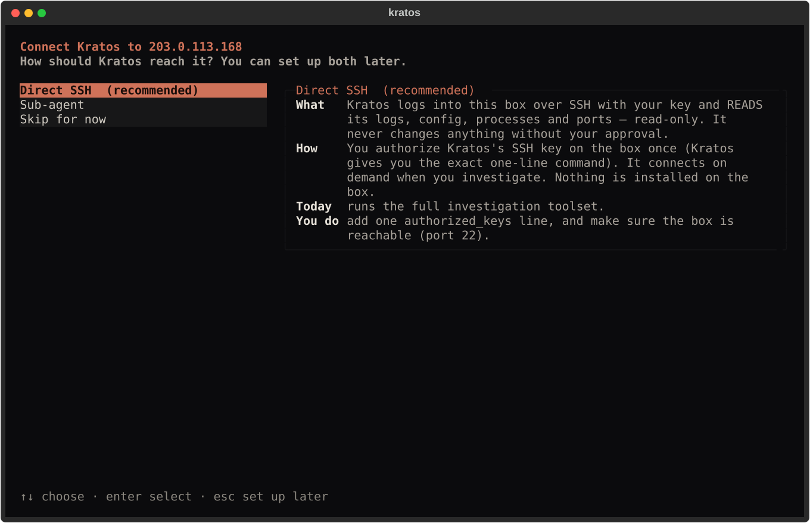
</p>

The rest of this section is the Direct SSH path; the sub-agent path has its own
section, [Machines you reach through a sub-agent](#machines-you-reach-through-a-sub-agent).
Point Kratos at a host:

```
/target 192.168.1.50
```

(Use your machine's address or hostname. To have Kratos look at *its own* computer,
use `/target` and pick the "this host" option, or just ask it to "investigate your
own host".)

Kratos then checks the connection and shows you a short checklist of anything the
target still needs. Typically that's:

- an SSH key Kratos can log in with,
- permission to read the system logs (either through a group membership or a
  narrow sudo rule),
- two small helper programs installed on the target (`yara` and `lsof`),
- the SSH port reachable from the Kratos machine.

<p align="center">
  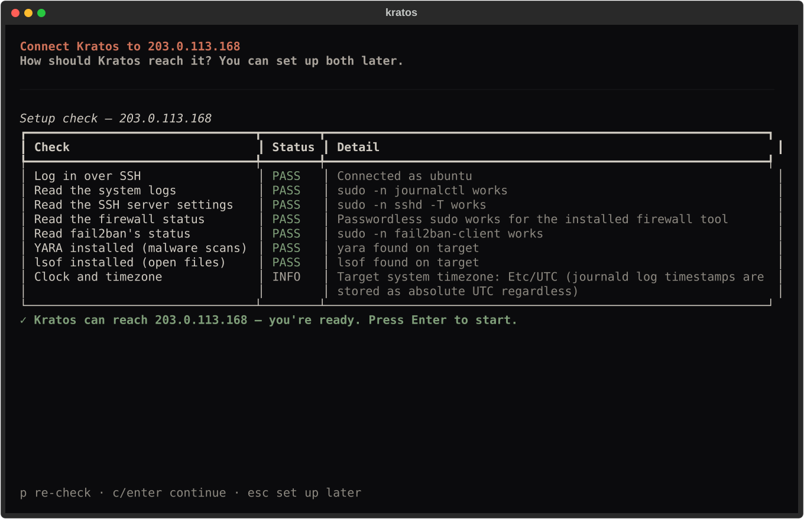
</p>

Kratos doesn't run these fixes for you — it only observes. Instead it gives you
the exact commands to run **on the target** yourself, so you stay in control. Run
them, then check again with:

```
/target verify
```

When every line passes, you're ready. If a check fails, the checklist tells you
what to do about it — and [When something goes wrong](#when-something-goes-wrong)
covers the common cases.

---

## Your first investigation

Just describe what you want to know, in normal words:

```
check this host for signs of an SSH brute-force
```

Kratos takes it from there. It decides which read-only checks to run, runs them
one at a time (you'll see each step appear), pulls the results together, and writes
up what it found with a recommended next step.

<p align="center">
  
</p>

Other things you can ask, to get a feel for it:

- *"is anything listening on the network that shouldn't be?"*
- *"have any important system files changed recently?"*
- *"who has been using sudo in the last day?"*
- *"who can become root on this box, and was anyone added recently?"* — Kratos lists
  sudo/admin members, root-equivalent groups (docker, lxd, …), extra UID-0 accounts and
  sudoers grants, plus who was added and when, and what changed since it last checked.
- *"is there any malware on this machine?"* — a YARA sweep of the usual drop locations
  (home directories, `/tmp`, web roots, …), reporting exactly which places it scanned
  and what it couldn't read.

You don't have to phrase these a special way. If your request is unclear or could
go several directions, Kratos asks you first (see below) rather than guessing.

---

## Understanding findings

When Kratos finds something, it writes a **finding**: a short, titled result with
the evidence behind it and, usually, a recommended action. Each finding has a
**severity**, shown by color:

- **red** — critical or high. Something that needs attention.
- **amber** — medium or low. Worth a look.
- **green** — informational, or an all-clear.

Type `/report` at any time to see all of a session's findings again, most severe
first. A finding is Kratos's *conclusion*, not an action — it doesn't act on a
finding on its own.

<p align="center">
  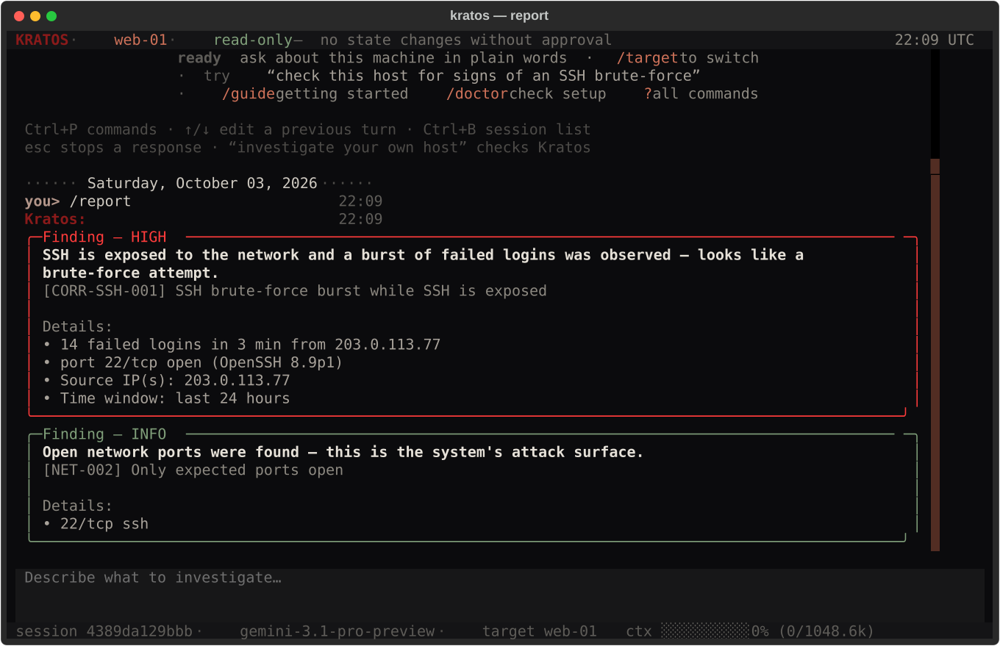
</p>

---

## When Kratos asks you a question

Sometimes a request genuinely could go several ways — how deep to look, which of
two hosts you meant. Instead of guessing, Kratos asks, and lays out the choices
with one recommended:

<p align="center">
  
</p>

Use the arrow keys and Enter to pick one, type your own answer instead, or press
`Esc` to let Kratos decide. This is just a question — answering it never gives
Kratos permission to change anything.

---

## When Kratos asks permission

A few actions have real consequences: running a command on the Kratos machine
itself, or keeping a new tool Kratos wrote. For those, Kratos stops and asks for a
plain yes.

The rule is simple and always the same: **`y` means yes. Anything else — `n`,
Enter, Escape, closing the prompt — means no.** If you're unsure, just press
Enter; the safe answer is the default. Kratos will never take a silence or a
mistyped key as a yes.

<p align="center">
  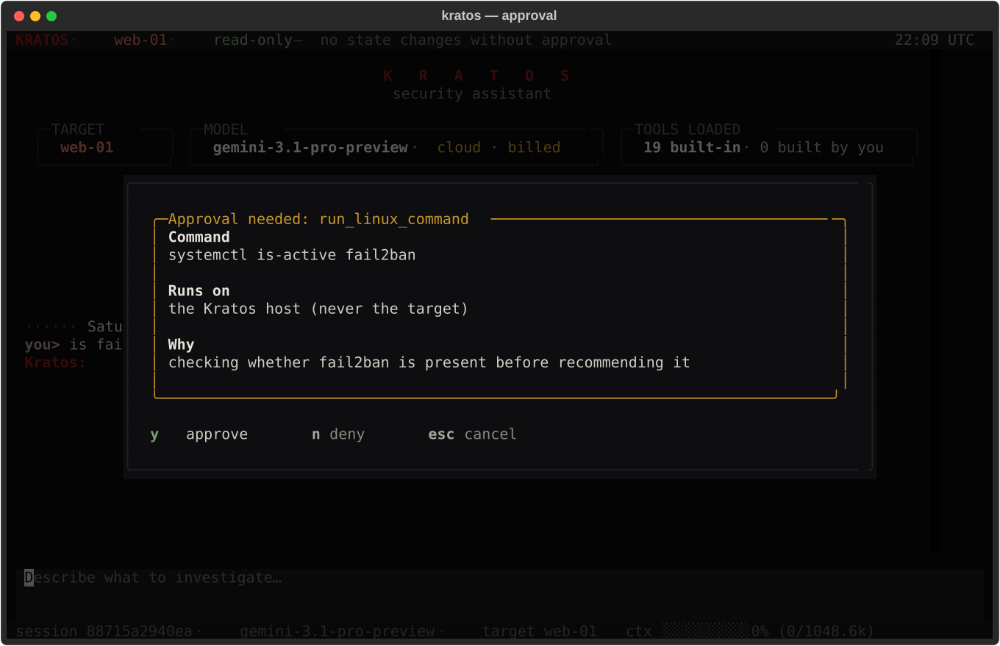
</p>

Note the difference from the previous section: a *question* (clarify) helps Kratos
decide how to proceed and grants nothing. A *permission* prompt is the gate before
something with consequences actually happens.

---

## Two ways to analyze

There are two styles, and you'll use both:

- **Just ask.** You describe a goal and Kratos reasons through it, choosing tools
  based on what it finds. Flexible; good for "go look into this."
- **`/run` — the standard audit.** A fixed, repeatable sweep: the same checks in
  the same order, every time, with no model deciding anything. Good for "give me
  the regular once-over" and for comparing results over time.

Same read-only tools underneath; the difference is whether the model is steering.

---

## The commands

You never *have* to memorize these — `?` lists them and `Ctrl+P` searches them —
but here's the map. Everything starts with `/`.

<p align="center">
  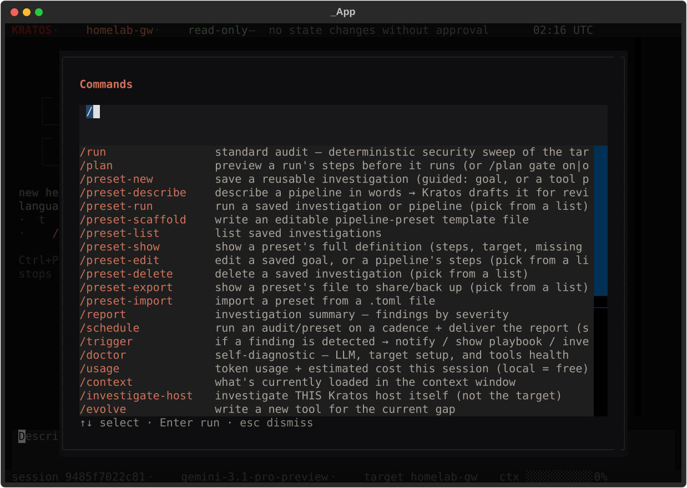
</p>

**Getting around**

| Command | What it does |
| --- | --- |
| `/guide` | the short, in-app version of this guide |
| `/help` or `?` | list every command |
| `/target <host>` | connect a machine to watch (and check its setup); `/target verify` re-checks; `/target link` changes how it's reached |
| `/sessions` (or `Ctrl+B`) | go back to the list of past sessions |
| `/rename <name>` | give this session a name |
| `/clear` | clear the screen (your history is kept) |
| `/reset` | start this session fresh (old history is archived, not deleted) |
| `/delete` | archive this session |
| `/exit` | leave |

**Investigating**

| Command | What it does |
| --- | --- |
| *(just type a question)* | Kratos investigates it, picking its own tools |
| `/run` | the standard fixed audit (no model steering) |
| `/plan` | preview exactly which steps a run will take; fixed audits show this preview and ask first by default (`/plan gate off` skips it) |
| `/report` | show this session's findings by severity |
| `/investigate-host` | investigate the Kratos machine itself, not the target |
| `/use <tool>` | run one specific tool directly |
| `/tools` | list every tool Kratos can use, built-in and self-written |

**Building and reusing**

| Command | What it does |
| --- | --- |
| `/evolve` | build a new tool for something Kratos can't do yet |
| `/preset` | save an investigation to re-run later (`/preset new`, `list`, `run`, `show`, `edit`, `delete`, `export`, `import`) |
| `/preset-describe` | describe a pipeline in words; Kratos drafts it for you to review |
| `/schedule` | run an audit or preset automatically on a timer |
| `/trigger` | when a finding shows up: notify you, show a response playbook, or investigate it |

**Checking and configuring**

| Command | What it does |
| --- | --- |
| `/doctor` | check that your setup (model, target, tools) is healthy |
| `/usage` | tokens used and rough cost this session |
| `/context` | how full the model's memory is right now (`/compact` makes room) |
| `/model` | switch, add, or edit which model Kratos uses |
| `/settings` | models, tools, timezone, and this session's options |
| `/timezone` | show or set the timezone times are displayed in (stored times stay UTC) |
| `/subagent` | add and manage the agents on machines you can't SSH into |
| `/whitelist` | a sub-agent's allowlist for the experimental fix channel |
| `/run-fix` | send a recommended fix to a box's sub-agent, if it's allowlisted there |
| `Ctrl+T` | change the color theme |

---

## Questions about time

Ask about a period in normal words — *"in the last 24 hours"*, *"since Monday"*,
*"this week compared with last week"* — and Kratos works out the exact window and
shows it under the step that used it:

```
✓ measure_auth_activity  Measure auth activity
    window w1 last 24 hours: 2026-10-01 09:00 → 2026-10-02 09:00 (UTC) · counted in full
```

For logins and sudo use it doesn't read a sample of log lines and estimate: it
counts **every** matching event in that window on the target itself, and says
plainly when part of the window couldn't be covered (logs that were rotated away, a
machine that was off). If the target's clock is wrong, Kratos measures the offset
and corrects for it. Comparisons ("is this more than usual?") are worked out by
Kratos from the counts, not by the model.

You can also ask what a machine looked like at a past time — *"was port 8080 open
last week?"*, *"who had sudo on Monday?"* — and Kratos answers from its own saved
scans, baselines and snapshots, telling you how close in time the nearest one is,
or that it has no record. It never fills the gap with a guess.

Times are shown in your timezone (`/timezone` to change it) and stored in UTC.

---

## Machines you reach through a sub-agent

Some machines can't take an SSH connection from Kratos: a VPS behind a provider
firewall, a box behind NAT, one where you'd rather not open port 22 at all. For
those, you install a small **sub-agent** on the machine. It connects *out* to
Kratos, so the machine opens no port, and it runs as a service so it survives
reboots.

<p align="center">
  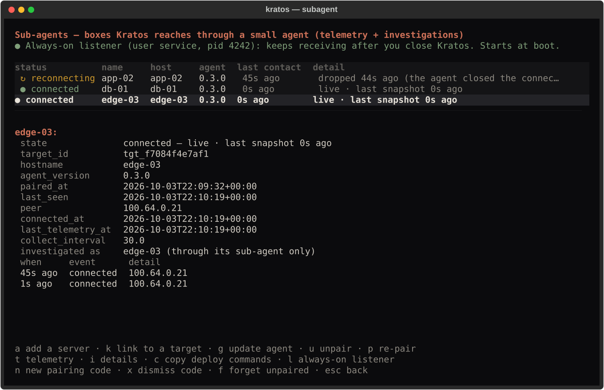
</p>

**Adding one.** Choose **Sub-agent** when you add a machine, or open `/subagent`
and press `a`. Kratos asks for a name and which address the machine should connect
to (your Tailscale address is listed first — it reaches a machine anywhere, without
opening ports), then writes a one-command installer. Run it on the machine
yourself, or let Kratos copy and run it over SSH for you once. Within seconds the
row turns **connected**.

**What it does from then on.**

- It streams the machine's status — uptime, disk, listening ports, hashes of
  critical files — every 30 seconds, whether or not you're investigating.
- Investigations read the machine through the agent's own fixed set of reads:
  logs and login activity, privileged accounts, processes, open files,
  configuration checks, file hashes, and YARA scans. Kratos never sends it command text, every request is
  signed, and a replayed request is refused. Each step says it was read through
  the sub-agent.
- Port and vulnerability scans need a direct network path from Kratos, so they're
  skipped for a machine reached only through its agent — and the answer tells you
  that part wasn't checked.
- YARA uses the rules on the machine itself (a starter set ships with the agent;
  add your own under `/etc/kratos-subagent/yara/`), scans common places like
  `/tmp`, `/home`, `/var/www` and `/opt`, never scans credential files (SSH keys,
  `.env`, shadow…), and reports which rule matched which file at which offset —
  never the matched text.

<p align="center">
  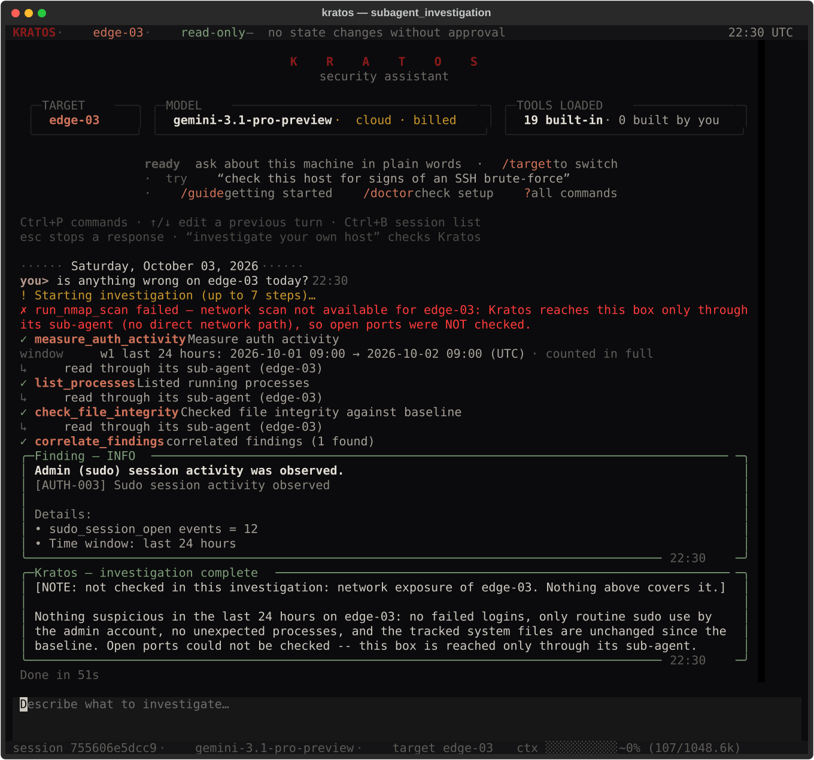
</p>

**Which machine is which.** Kratos never guesses. Choosing Sub-agent links the
machine to its agent once it checks in. If you later type an address that looks
like a machine you've paired, Kratos *asks* before linking. `/target link` switches
a target between **sub-agent only** and **SSH first, sub-agent if SSH can't
connect**; `/target verify` and `/doctor` show which way it's reached right now.

**Keeping it running.** The agents connect to a *listener* in Kratos. Opening
`/subagent` starts one inside the running Kratos; press `l` there to install it as
an always-on service instead, so status keeps arriving after you close Kratos.

**Updating, unpairing.** Select a machine and press `g` to update its agent in
place (it keeps its pairing), `u` to unpair it, `k` to link it to a target, `i`
for details. An agent installed before investigations-through-the-agent existed
needs one `g` update.

**On a plain network.** The link between agent and Kratos has no encryption of its
own — that's why Tailscale is recommended. If you pick a non-Tailscale address,
Kratos asks whether to allow investigation reads over it; if you don't, the agent
still sends status but refuses reads.

---

## Building a new tool with /evolve

This is Kratos's most unusual feature, and it's built to be safe. If Kratos needs
a check it doesn't have, it can write one for itself — but only with your review.

Here's the whole flow:

1. **You give it an idea.** `/evolve` on its own uses a suggestion Kratos made — it
   makes one when an investigation hits something no tool covers, including when its
   own answer says it couldn't check something — or
   `/evolve "list which users can use sudo on the target"` starts from your words.
2. **Kratos writes a test first.** Every tool needs a small test that defines what
   "correct" means for it. Kratos can draft that test for you from your idea; you
   read it and can edit it. This test is the anchor — it's what keeps a
   self-written tool honest.
3. **Kratos writes the tool and runs the test in a sandbox.** The sandbox is a
   locked-down box with no network and no access to your files, so a
   work-in-progress tool can't do any harm while it's being checked. If the test
   fails, Kratos tries again a couple of times.
4. **You review and decide.** Kratos shows you the finished code, the test
   results, and a set of "things worth looking at" flags. Nothing is kept until
   you say yes. If you say no, nothing is saved.

<p align="center">
  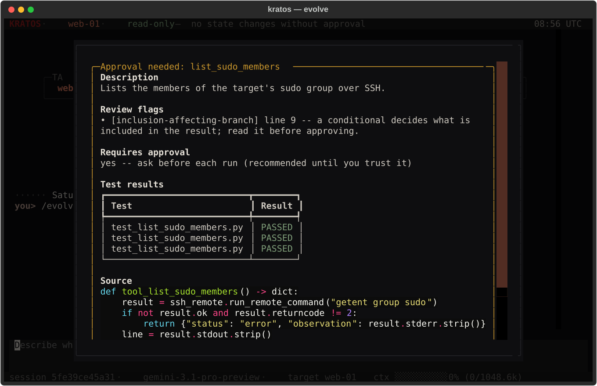
</p>

A kept tool becomes part of Kratos and runs on the real machine from then on —
which is exactly why the review step exists and why there's no way to skip it.
By default a new tool asks you before each run until you trust it; you can change
that later in Settings.

The first time you run `/evolve`, Kratos shows a short explainer of all this
before it starts. `/evolve help` brings it back any time.

---

## Saving and repeating work

If you find yourself running the same investigation often, save it.

- **Presets** save an investigation so you can run it again with one command.
  `/preset new` walks you through it; `/preset list` shows what you've saved; a
  saved preset also gets its own `/<name>` command.

  <p align="center">
    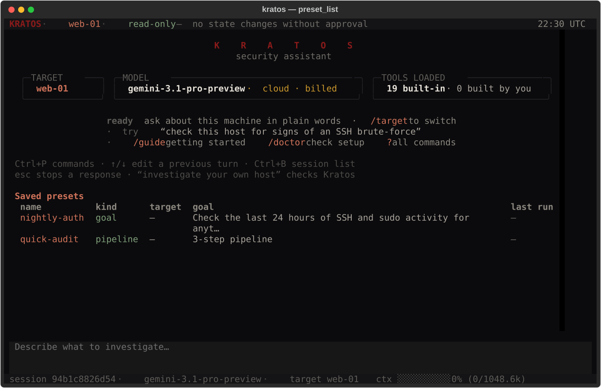
  </p>

- **Pipelines** are a fixed sequence of read-only tools you build once and re-run
  for a deterministic sweep — no model, same steps every time.
- **Schedules** run an audit or a preset automatically on a timer (say, every
  night) and can deliver the report. Kratos writes out the timer for you to
  install; it never installs system services on your behalf. If a scheduled run
  will use a cloud model, Kratos warns you first, because it costs money each time.

  <p align="center">
    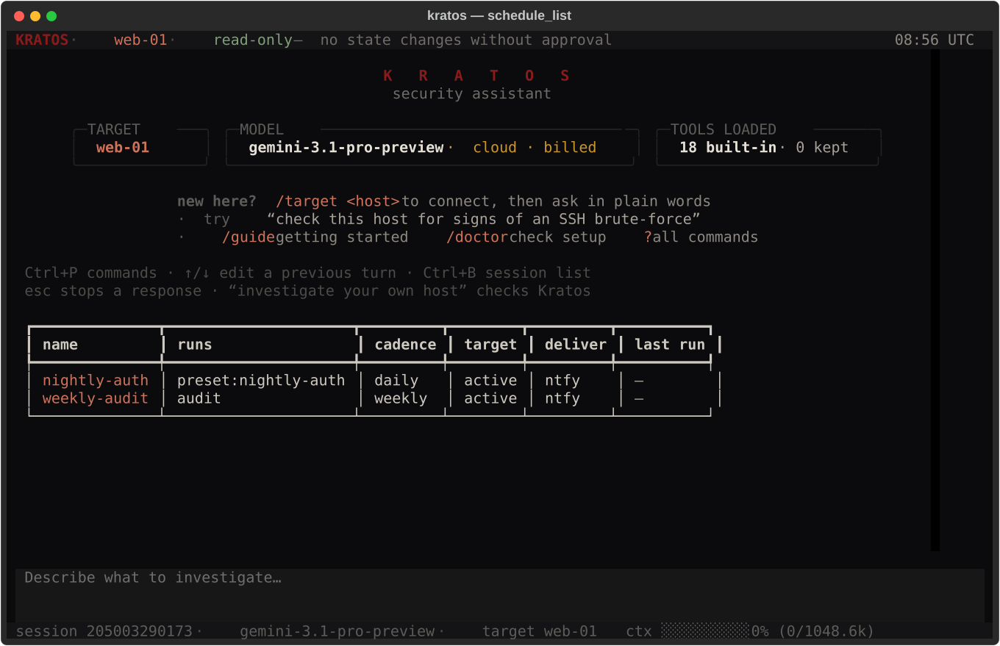
  </p>

- **Triggers** watch for a kind of finding and react — for example, send a
  notification when anything high-severity turns up.

### Getting alerts on your phone

Alerts are sent through [ntfy](https://ntfy.sh), a free push-notification
service, and they're **off until you turn them on**:

1. Run `/doctor`. The "notifications" line suggests a random topic name, like
   `KRATOS_NTFY_TOPIC=kratos-3f9c…`.
2. Add that line to your `.env` file and restart Kratos.
3. Install the ntfy app and subscribe to the same topic name.

One thing to know: an ntfy topic has no password. **Anyone who knows the topic
name can read every alert sent to it**, and alerts include your findings. That's
why Kratos never comes with a topic filled in, and why the suggested one is long
and random. For anything beyond trying it out, run your own ntfy server (set
`KRATOS_NTFY_BASE_URL`) or use an ntfy access token (set `KRATOS_NTFY_TOKEN`).
Until a topic is set, schedules still save their reports on disk; they just
don't send them anywhere.

---

## Keeping an eye on things

- **`/doctor`** is your "is everything OK?" button. It checks the model
  connection, your settings, the target, and the tools, and tells you the fix for
  anything that's wrong.

  <p align="center">
    
  </p>

- **`/usage`** shows how many tokens this session has used and a rough cost. With
  a local model it's free and says so.

  <p align="center">
    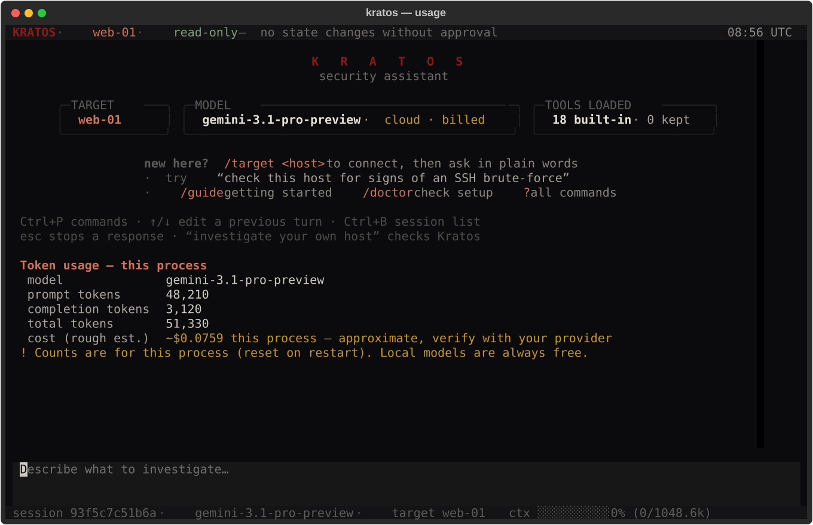
  </p>

- **`/context`** shows how full the model's short-term memory is. When it gets
  full, `/compact` summarizes the older parts to make room while keeping the
  important points.

  <p align="center">
    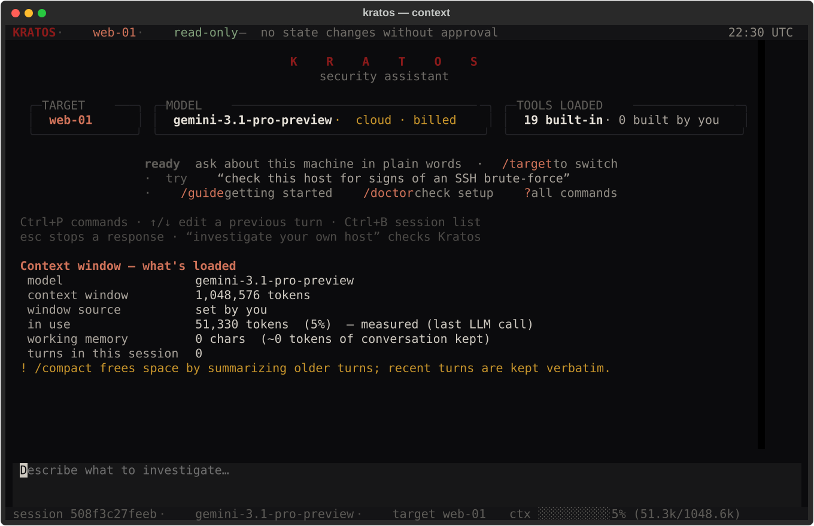
  </p>


---

## Using Kratos from the command line and other tools

Everything starts from `kratos`, but a few things work without the full-screen UI:

| Command | What it does |
| --- | --- |
| `kratos investigate "<goal>"` | one investigation, printed to the terminal |
| `kratos run` | the standard fixed audit |
| `kratos scheduled-run <name>` | run one saved schedule (what the installed timers call) |
| `kratos subagent-install` | write a sub-agent installer from the command line |
| `kratos subagent-serve` | run the sub-agent listener in the foreground |
| `kratos subagent-status` | list paired machines and whether they're connected |
| `kratos mcp-serve` | start the MCP server (below) |

`kratos --help --all` lists every subcommand. Without a session, these use the
default target Kratos saved the first time you set one (or `KRATOS_SSH_HOST`).

**MCP.** `kratos mcp-serve` lets other AI tools that speak the
[Model Context Protocol](https://modelcontextprotocol.io) — Claude Desktop,
OpenWebUI and others — ask Kratos to investigate a machine, fetch a session's
findings, list sessions, and send a notification built from real findings. It's
read/investigate-only on purpose: every tool that would need a yes/no from you is
left out, and the other tool never picks Kratos's internal steps — Kratos's own
loop does, with all its checks.

---

## The experimental fix channel

Everything above is observe-and-recommend: Kratos tells you what to run, and you
run it. There is one experimental exception, and it is **off for every machine**.

With a sub-agent on a machine, Kratos can carry out a small set of allowlisted
fixes there — for example "ban this IP in fail2ban" or "enable and start this
service". `/whitelist` shows each machine's allowlist: which actions are on, how
risky each is, and what the machine's own agent will accept.

<p align="center">
  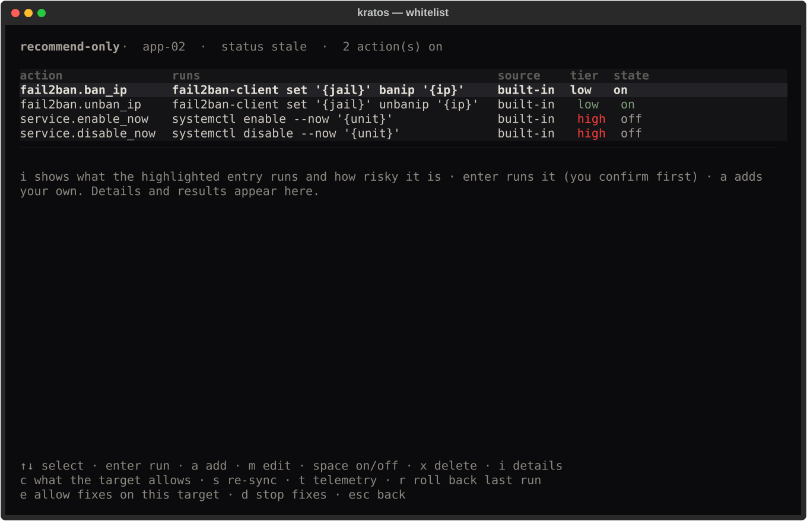
</p>

What has to be true before anything runs:

1. The agent on that machine was started with execution switched on. That's a
   setting on the machine itself; the installer never sets it.
2. You've given consent for that machine in `/whitelist` (it explains the risk
   first).
3. The action is on in that machine's allowlist. The agent carries its own fixed
   list of exactly which programs and arguments it will ever run; Kratos can
   narrow that list, never widen it. Exact commands beyond it can only be added by
   the machine's own administrator, in a root-owned file on the machine.
4. You type `EXECUTE` for that run (high-risk actions ask a second time). After an
   investigation recommends a fix that matches an allowlisted action, `/run-fix`
   opens that same confirmation.

**This channel has not yet had its independent security review. Don't turn it on
for a machine you care about.** Leaving it off costs you nothing: every
recommendation still comes with the exact command for you to run.

---

## Making it yours

Press `Ctrl+T` (or open `/settings`) to change the color theme. Kratos comes in
Kratos Red by default, plus Slate Blue, Matrix Green, and Cyan. The colors that
carry meaning — danger red, safe green — stay the same in every theme, so switching
is purely cosmetic.

<p align="center">
  
  
</p>

`/settings` also lets you manage models, decide which self-written tools need to
ask before running, and set your timezone.

---

## When something goes wrong

**"A sub-agent machine shows as not connected."** Open `/subagent` and select it
(`i`) — it says why it dropped. If Kratos says *"No Kratos listener is running"*,
open `/subagent` (which starts one) or install the always-on listener there (`l`).
If it says the listener *"can't serve investigation reads"*, restart it with the
command shown, so it runs the same version as the rest of Kratos.

**"It can't connect to the target."** Run `/doctor`. It will point at the exact
problem — the host is wrong, the SSH port is closed, the key isn't accepted, or a
required permission or helper program is missing on the target. Each failing line
comes with the fix. After fixing on the target, run `/target verify`.

**"The model isn't responding."** `/doctor` checks this too. Usually it's a wrong
address or key in `.env`, or (for a local model) the model server isn't running.
`/model` lets you switch to another one.

**"An investigation stopped with an error."** Kratos shows a plain message and
keeps your session — an error in one step never loses your work. Try rephrasing,
or run `/doctor` if it keeps happening.

**"A tool I built with /evolve keeps failing its test."** That's the safety net
working — a tool that can't pass its own test isn't kept. Either the idea needs to
be narrower, or the test itself needs adjusting. You can edit the test and try
again; nothing is saved until it passes and you approve it.

**"It's asking me something and I don't know what to pick."** For a question, the
recommended option (or just letting it decide with `Esc`) is a safe choice. For a
permission prompt, pressing Enter is always the safe "no."

---

## Words you'll see

- **Target** — the machine Kratos is watching.
- **Finding** — a titled result Kratos reached, with evidence and a severity.
- **Investigation** — one run where Kratos looks into a question.
- **Tool** — one specific check Kratos can run (read a log, scan ports, and so on).
- **Preset** — a saved investigation you can re-run.
- **Pipeline** — a fixed sequence of tools run in order, with no model steering.
- **Observe-only** — by default, Kratos reads and advises; it doesn't change the
  target itself. (The one exception is the experimental fix channel, off unless
  you turn it on for a machine.)
- **Sub-agent** — a small agent on a machine that connects out to Kratos, for
  machines Kratos can't reach over SSH.
- **Listener** — the part of Kratos that sub-agents connect to.
- **Allowlist** — the fixed set of actions a machine's sub-agent will accept, if
  the experimental fix channel is on for it.
- **Sandbox** — the locked-down space where a newly written tool is tested safely.
- **Approval / "requires approval"** — a yes/no gate before something with real
  consequences happens. A non-answer always means no.

---

For the design and the reasoning behind Kratos's choices, see
[DESIGN.md](DESIGN.md). For the short version of all this, type `/guide` inside
Kratos.
